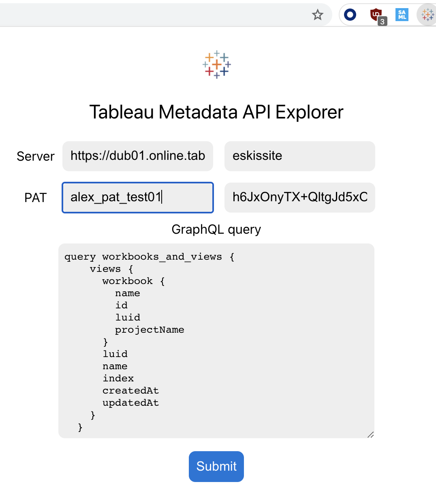
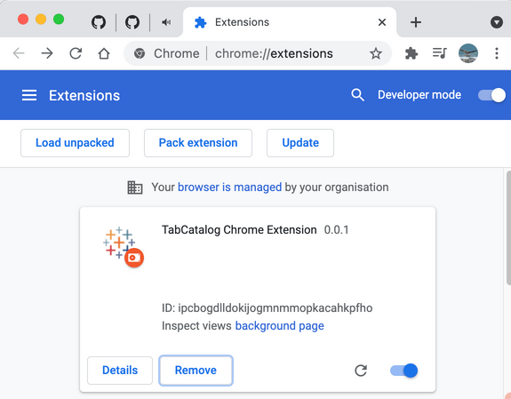

# TabCatalog - Tableau Metadata API Explorer Chrome Extension

Using ([Tableau's Metadata API](https://help.tableau.com/current/api/metadata_api/en-us/index.html)) , one can explore metadata from the ([Tableau Catalog])(https://www.tableau.com/products/add-ons/catalog)) using GraphQL queries. 

This simple (Chromium-based browser)extension allows one to quickly explore data from the Catalog and even export the results to a Json file, to further data analysis with e.g ([Tableau Desktop](https://www.tableau.com/products/desktop)) and ([Tableau Prep](https://www.tableau.com/products/prep)).



## Getting Started

You will need to have [npm](https://npmjs.com) installed. Download a copy of this code to a folder on your computer.

Install all the required packages:

```
npm install
```

Build the extension from webpack

```
npm run build
```

To install on Chrome/Edge/Brave (or any Chromium-based browser), use the 'three dot' menu on the top right corner of the browser to find the Extensions panel. From there, select 'Load Unpacked' to load a new extension. Open the 'dist' folder at the prompt and the extension will load.



To use it, you will need a Tableau Server Personal Access Token name and key ([read more on how to generate one](https://help.tableau.com/current/server/en-us/security_personal_access_tokens.htm#creating-tokens)) and the URL for your Tableau Server or Tableau Online, for example https://my-server.com or https://eu-west-1a.online.tableau.com . You will also need the Tableau Site name.

You'll also need to know how to write some GraphQL queries compatible to the Tableau Catalog. You can find some examples ([here](https://help.tableau.com/current/api/metadata_api/en-us/docs/meta_api_examples.html#common-queries-to-get-your-started). To get started real quick, try this one:

```yaml
query getViews_and_Workbooks {
    views {
      workbook {
        name
        projectName
      }
      name
      index
      path
      createdAt
      updatedAt
    }
  }
  ```